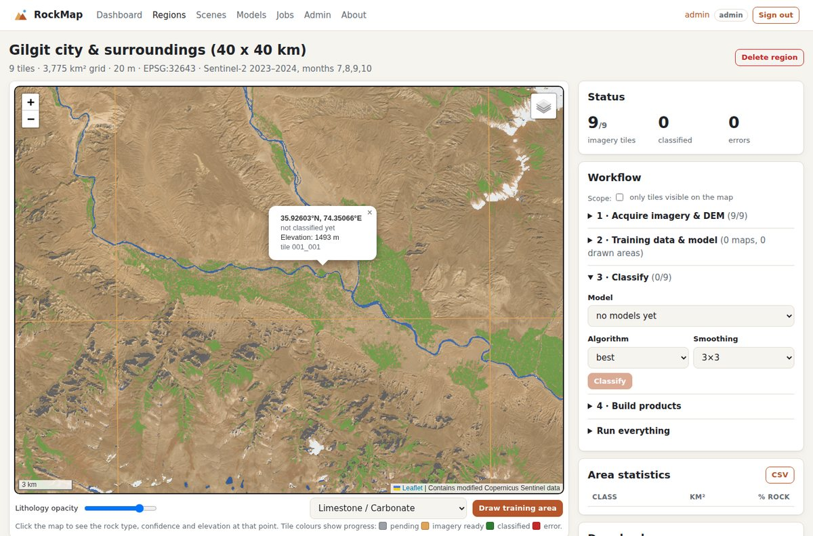

# RockMap: AI-Based Satellite Rock/Stone Detection and Geological Mapping System

RockMap is a geological mapping platform that maps **surface rock types across whole regions such as Gilgit-Baltistan**. Everything runs from a web dashboard:

1. It downloads cloud-free **Sentinel-2** imagery and the **Copernicus 30 m DEM** automatically.
2. It masks out snow, glaciers, water, vegetation and terrain shadow.
3. It classifies the remaining surface into lithology classes with a **CNN**, benchmarked against Random Forest and SVM.
4. It publishes seamless maps, statistics per district, GIS files and PDF reports.

Final Year Project, Department of Computer Science, Government Degree College Zaim, Charsadda (Bacha Khan University Charsadda). Authors: **Aleena (Roll No 40)** and **Amna (Roll No 39)**.


*Gilgit city region: a real cloud-free Sentinel-2 composite built automatically by RockMap, shown on the region map with its processing tiles.*

## What it does

| Capability | Details |
|---|---|
| **Region-scale mapping** | Define an area (all of Gilgit-Baltistan, a preset valley, a rectangle you draw, or an uploaded boundary). It is cut into 20 km tiles and processed tile by tile. Every stage can be resumed, so an interrupted job continues where it stopped. |
| **Automatic data acquisition** | Sentinel-2 L2A cloud-optimised GeoTIFFs and the Copernicus DEM are read from AWS Open Data, with no account or key needed. For each tile, a median composite of the least-cloudy late-summer scenes is built. Clouds and shadows are removed using the SCL layer, and steep slopes get topographic C-correction. |
| **Mountain-aware masking** | Snow/glacier, water, dense vegetation and deep shadow are mapped as separate classes, so they are never mistaken for rock. |
| **AI classification** | A fully convolutional CNN (PyTorch) is trained alongside Random Forest and SVM baselines. Train, validation and test sets are split by spatial blocks. The system reports accuracy, kappa, F1 and a confusion matrix for each model. |
| **Training data** | Upload digitised geological maps (GeoJSON plus a table mapping map units to classes), or **draw training areas on the map** in the dashboard. |
| **Products** | A seamless web map with a built-in tile server, GeoTIFF mosaics with overviews (open in QGIS/ArcGIS), GeoJSON polygons, area statistics per class and per district (CSV), a multi-page PDF report, and point queries (rock type, confidence, elevation). |
| **Platform** | User accounts with roles (admin / analyst / viewer), CSRF protection, login lock-out, audit log, personal API tokens and a REST API. Background jobs are persistent, with progress, logs and cancel. Jobs can run in a separate worker process. Production serving uses waitress, and there is a Docker Compose setup. Leaflet is bundled, so the map works offline. |
| **Single-scene mode** | Upload any Sentinel-2 or Landsat GeoTIFF, train on it and classify it. Large scenes are processed in blocks. |

## Quick start

```bash
python -m venv .venv && source .venv/bin/activate          # Windows: .venv\Scripts\activate
pip install torch --index-url https://download.pytorch.org/whl/cpu   # CPU build (smaller)
pip install -e ".[dev]"
rockmap serve                  # http://127.0.0.1:5000
```

On first start, RockMap creates the user **admin**. Its password is printed in the console and saved in `data/initial_admin_password.txt`. Change it under *Profile* after signing in. You can also set `ROCKMAP_ADMIN_PASSWORD` before the first start.

### Mapping Gilgit-Baltistan (dashboard)
1. **Regions → New region**: start with a preset such as *Gilgit city*, *Hunza*, *Skardu* or *Astore*, or choose *Gilgit-Baltistan (whole region)*, which is about 190 tiles.
2. **Acquire imagery & DEM**: tiles fill in on the map as they finish, at about 30–60 s per tile. Tick *only tiles visible on the map* to process just the area you are looking at.
3. **Training data**: upload your digitised geological map as GeoJSON, with a unit → class table (see `examples/gb_geology_mapping.json`). You can also draw training areas where you are certain of the rock type, for example from field visits.
4. **Train model**, then **Classify**, then **Build products**. Upload district boundaries first if you want statistics per district.
5. Explore the map: click anywhere for rock type, confidence and elevation. Then download the GeoTIFFs, GeoJSON, CSV or PDF.

The same workflow from the command line:
```bash
rockmap region create --preset gilgit-baltistan --out regions/gb
rockmap region acquire regions/gb                          # resumable; --tiles 004_002 ... for a subset
rockmap region train regions/gb --reference geology.geojson --field UNIT \
        --mapping examples/gb_geology_mapping.json --out models/gb
rockmap region classify regions/gb --model models/gb
rockmap region mosaic regions/gb
rockmap region stats regions/gb --districts gb_districts.geojson --json stats.json
rockmap region export regions/gb --out gb_lithology.geojson
rockmap region report regions/gb --out gb_report.pdf
rockmap region query regions/gb --lon 74.31 --lat 35.92
```

### Try it without real data
`rockmap demo` builds a synthetic study area, trains all three models, then classifies and validates it (about 2 min on a CPU). In the dashboard, the equivalent is *Dashboard → + Synthetic study area*.

## Important: accuracy depends on your training data

The software is complete, but no machine can know the geology of Gilgit-Baltistan without examples. **A model is only as good as the reference data it is trained on.** Before trusting a map:
* Train on a digitised published geological map, such as Searle & Khan (1996) *Geological Map of North Pakistan* or Geological Survey of Pakistan sheets, and/or on training areas checked in the field.
* Check the accuracy report. The test set is held out by spatial blocks, so the numbers are honest.
* Treat results as a reconnaissance map. Verify in the field before mining, engineering or legal use.

The built-in Gilgit-Baltistan outline is an **approximate** processing extent (about 72,150 km² against the official 72,971 km²). For administrative work, upload an official boundary.

## Documentation
* [docs/GILGIT_BALTISTAN.md](docs/GILGIT_BALTISTAN.md): step-by-step guide for mapping GB, data volumes and timings
* [docs/USER_MANUAL.md](docs/USER_MANUAL.md): dashboard and command-line manual
* [docs/DEPLOYMENT.md](docs/DEPLOYMENT.md): server installation, Docker, HTTPS, backups, users, REST API
* [docs/ARCHITECTURE.md](docs/ARCHITECTURE.md): system design and methodology (for the project report)

## Lithology and surface classes

| Id | Class | Id | Surface mask |
|---|---|---|---|
| 1 | Limestone / Carbonate (incl. marble) | 250 | Snow / Glacier / Ice |
| 2 | Sandstone (incl. quartzite) | 251 | Water |
| 3 | Shale / Mudstone (incl. slate) | 252 | Dense vegetation |
| 4 | Granite / Felsic Igneous (Karakoram & Kohistan batholiths) | 253 | Terrain shadow |
| 5 | Basalt / Mafic Igneous (Chilas gabbro, Kohistan arc, ophiolites) | 255 | Cloud / no data |
| 6 | Metamorphic (gneiss, schist; Nanga Parbat, Karakoram metamorphics) | | |
| 7 | Alluvium / Quaternary deposits (river terraces, moraine, scree) | | |

## Tests
```bash
pytest                                  # 50 tests (web platform, region engine, acquisition logic, ML pipeline)
ROCKMAP_NETWORK_TESTS=1 pytest          # plus a live download of Sentinel-2 + DEM near Gilgit
```

## Data credits
Contains modified Copernicus Sentinel data and Copernicus DEM (ESA / European Union), accessed through the AWS Open Data Registry (Element 84 `sentinel-cogs`, `copernicus-dem-30m`). Map display uses Leaflet (BSD-2), with optional OpenStreetMap and Esri basemaps when online.
