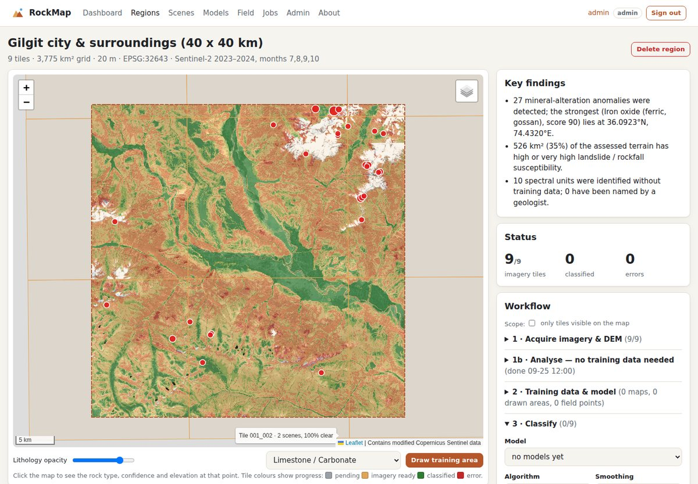
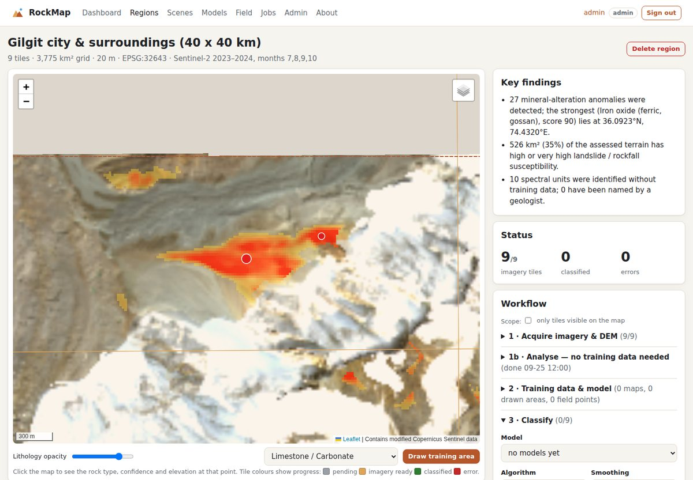
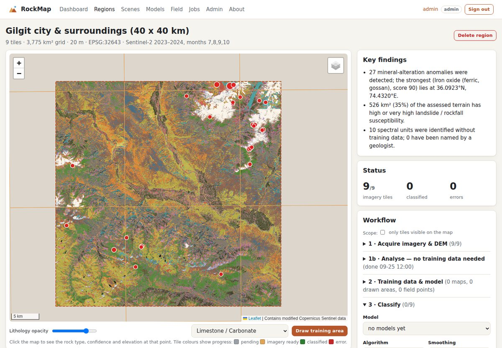
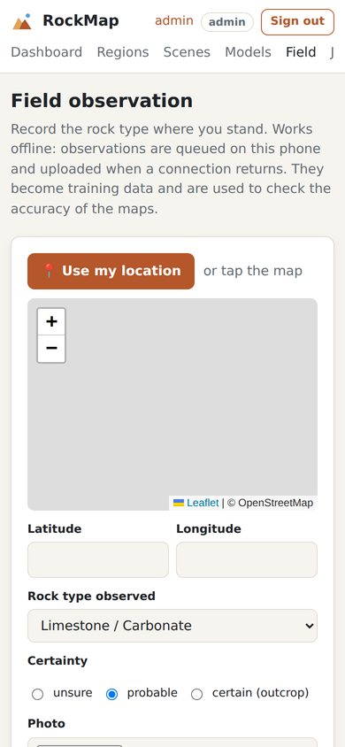

# RockMap: AI-Based Satellite Rock/Stone Detection and Geological Mapping System

RockMap is a geological mapping platform that maps **surface rock types across whole regions such as Gilgit-Baltistan**. Everything runs from a web dashboard:

1. It downloads cloud-free **Sentinel-2** imagery and the **Copernicus 30 m DEM** automatically.
2. It masks out snow, glaciers, water, vegetation and terrain shadow.
3. It classifies the remaining surface into lithology classes with a **CNN**, benchmarked against Random Forest and SVM.
4. It publishes seamless maps, statistics per district, GIS files and PDF reports.

Final Year Project, Department of Computer Science, Government Degree College Zaim, Charsadda (Bacha Khan University Charsadda). Authors: **Aleena (Roll No 40)** and **Amna (Roll No 39)**.


*Real data, Gilgit 40 × 40 km: landslide susceptibility with mineral-alteration targets (red dots), computed automatically from Sentinel-2 and the Copernicus DEM with no training data.*

| Target zoom (iron-oxide anomaly) | Spectral units (name them → rock map) | Phone field app (offline) |
|---|---|---|
|  |  |  |

## Run it in one command

| Windows | Linux / macOS |
|---|---|
| double-click **`run.bat`** (or `run.bat --real`) | **`./run.sh`** (or `./run.sh --real`) |

The first run installs everything into `.venv`, builds a fully processed demo and opens **http://127.0.0.1:5000**. Sign in as **admin / rockmap-demo**; you'll be asked to set your own password. Add `--gb` to map the **whole of Gilgit-Baltistan** from real Sentinel-2 imagery in about 40 minutes ([where the imagery comes from](docs/SATELLITE_DATA.md)). Add `--real` to also download and analyse a real 40 × 40 km area around Gilgit city from Sentinel-2. See **[docs/RUNNING.md](docs/RUNNING.md)** for manual installation, Docker, the phone field app and troubleshooting.

## What it does

| Capability | Details |
|---|---|
| **Region-scale mapping** | Map all of Gilgit-Baltistan, a preset valley, a rectangle you draw or an uploaded boundary. The area is cut into 20 km tiles that are processed one at a time, and interrupted runs pick up where they stopped. |
| **Automatic data** | Sentinel-2 L2A and the Copernicus DEM come from AWS Open Data, with no account needed. Each tile gets a cloud-free median composite of late-summer scenes. Steep slopes get topographic correction. |
| **Mountain-aware masking** | Snow, glaciers, water, dense vegetation and deep shadow are mapped as separate classes, never as rock. |
| **AI rock-type mapping** | A CNN is trained alongside Random Forest and SVM. Train and test sets are split by spatial blocks. Each model reports accuracy, kappa, F1 and a confusion matrix. |
| **Mineral prospectivity** *(new)* | Region-wide anomalies in clay, iron-oxide and ferrous band ratios are mapped, then turned into a **ranked list of exploration targets** with coordinates. Download as CSV or GeoJSON, or view on the map. |
| **Gemstone prospectivity** *(new in 2.3)* | Ranked target zones for **ruby & spinel (marble), aquamarine / topaz / tourmaline (pegmatite), emerald (contacts) and peridot / nephrite (ultramafic)**. Validated against known localities (AUC), with an optional Random Forest trained on them. Field finds count as localities. See [docs/GEMSTONES.md](docs/GEMSTONES.md). |
| **Landslide / rockfall susceptibility** *(new)* | A five-class hazard map built from slope, relief, river undercutting, rock strength and bare ground, with km² per class. |
| **Rock map without training data** *(new)* | The area is grouped into spectral units automatically. A geologist names them, and they become a lithology map in one click. |
| **Field app** *(new)* | A phone page that works offline: GPS, photo, rock type and certainty. Observations become training data and **validate the map** by measuring agreement. |
| **Key findings** *(new)* | A plain-language executive summary appears on the dashboard and in the PDF report. |
| **Client sharing** *(new)* | Public read-only links show maps, findings and targets without a login. |
| **Products** | Web map, GeoTIFF mosaics with **QGIS style files** *(new)*, GeoJSON polygons, district statistics as CSV, a multi-page PDF report, point queries and a REST API. |
| **Platform** | Admin / analyst / viewer roles, CSRF protection, login lock-out, audit log, API tokens, a persistent job queue with a worker process, Docker Compose, and maps that work offline. |

### Mapping Gilgit-Baltistan (dashboard)
1. **Regions → New region**: start with a preset such as *Gilgit city*, *Hunza*, *Skardu* or *Astore*, or choose *Gilgit-Baltistan (whole region)*, which is about 190 tiles.
2. **Acquire imagery & DEM**: tiles fill in on the map as they finish, at about 30–60 s per tile. Tick *only tiles visible on the map* to process just the area you are looking at.
3. **Training data**: upload your digitised geological map as GeoJSON, with a unit → class table (see `examples/gb_geology_mapping.json`). You can also draw training areas where you are certain of the rock type, for example from field visits.
4. **Train model**, then **Classify**, then **Build products**. Upload district boundaries first if you want statistics per district.
5. Explore the map: click anywhere for rock type, confidence and elevation. Then download the GeoTIFFs, GeoJSON, CSV or PDF.

The same workflow from the command line:
```bash
rockmap region create --preset gilgit-baltistan --out regions/gb
rockmap region acquire regions/gb                          # resumable; --tiles 004_002 ... for a subset
rockmap region train regions/gb --reference geology.geojson --field UNIT \
        --mapping examples/gb_geology_mapping.json --out models/gb
rockmap region classify regions/gb --model models/gb
rockmap region gems regions/gb --occurrences known_gems.csv   # gemstone prospectivity
rockmap region mosaic regions/gb
rockmap region stats regions/gb --districts gb_districts.geojson --json stats.json
rockmap region export regions/gb --out gb_lithology.geojson
rockmap region report regions/gb --out gb_report.pdf
rockmap region query regions/gb --lon 74.31 --lat 35.92
```

### Try it without real data
`rockmap demo` builds a synthetic study area, trains all three models, then classifies and validates it (about 2 min on a CPU). In the dashboard, the equivalent is *Dashboard → + Synthetic study area*.

## Important: accuracy depends on your training data

The software is complete, but no machine can know the geology of Gilgit-Baltistan without examples. **A model is only as good as the reference data it is trained on.** Before trusting a map:
* Train on a digitised published geological map, such as Searle & Khan (1996) *Geological Map of North Pakistan* or Geological Survey of Pakistan sheets, and/or on training areas checked in the field.
* Check the accuracy report. The test set is held out by spatial blocks, so the numbers are honest.
* Treat results as a reconnaissance map. Verify in the field before mining, engineering or legal use.

The built-in Gilgit-Baltistan outline is an **approximate** processing extent (about 72,150 km² against the official 72,971 km²). For administrative work, upload an official boundary.

## Documentation
* [docs/RUNNING.md](docs/RUNNING.md): **how to install and run** (one command, manual, Docker, phone app)
* [docs/DELIVERY.md](docs/DELIVERY.md): **customer installation, acceptance checklist, operations, backups**
* [docs/PITCH.md](docs/PITCH.md): competition pitch and 7-minute demo script
* [docs/SATELLITE_DATA.md](docs/SATELLITE_DATA.md): **where the satellite imagery comes from** (and why not Google Earth); whole-GB map in ~40 min
* [docs/GEMSTONES.md](docs/GEMSTONES.md): **gemstone prospectivity**: deposit models, known localities, real results, limitations
* [docs/GILGIT_BALTISTAN.md](docs/GILGIT_BALTISTAN.md): step-by-step guide for mapping GB, data volumes and timings
* [docs/USER_MANUAL.md](docs/USER_MANUAL.md): dashboard and command-line manual
* [docs/DEPLOYMENT.md](docs/DEPLOYMENT.md): server installation, Docker, HTTPS, backups, users, REST API
* [docs/ARCHITECTURE.md](docs/ARCHITECTURE.md): system design and methodology (for the project report)

## Lithology and surface classes

| Id | Class | Id | Surface mask |
|---|---|---|---|
| 1 | Limestone / Carbonate (incl. marble) | 250 | Snow / Glacier / Ice |
| 2 | Sandstone (incl. quartzite) | 251 | Water |
| 3 | Shale / Mudstone (incl. slate) | 252 | Dense vegetation |
| 4 | Granite / Felsic Igneous (Karakoram & Kohistan batholiths) | 253 | Terrain shadow |
| 5 | Basalt / Mafic Igneous (Chilas gabbro, Kohistan arc, ophiolites) | 255 | Cloud / no data |
| 6 | Metamorphic (gneiss, schist; Nanga Parbat, Karakoram metamorphics) | | |
| 7 | Alluvium / Quaternary deposits (river terraces, moraine, scree) | | |

## Tests
```bash
pytest                                  # 68 tests incl. a crawl of every page; CI runs them on Windows, macOS and Linux
rockmap doctor                          # installation self-check
ROCKMAP_NETWORK_TESTS=1 pytest          # plus a live download of Sentinel-2 + DEM near Gilgit
```

## Data credits
Contains modified Copernicus Sentinel data and Copernicus DEM (ESA / European Union), accessed through the AWS Open Data Registry (Element 84 `sentinel-cogs`, `copernicus-dem-30m`). Map display uses Leaflet (BSD-2), with optional OpenStreetMap and Esri basemaps when online.
