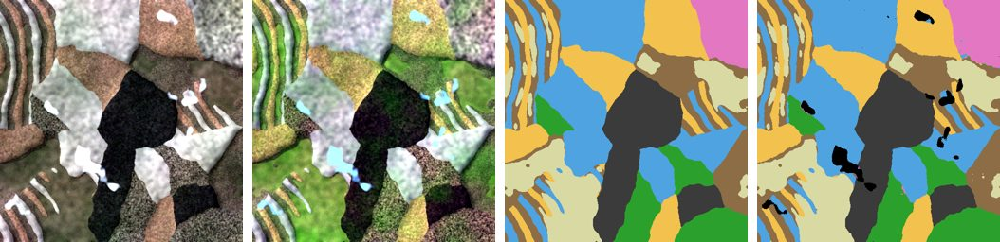
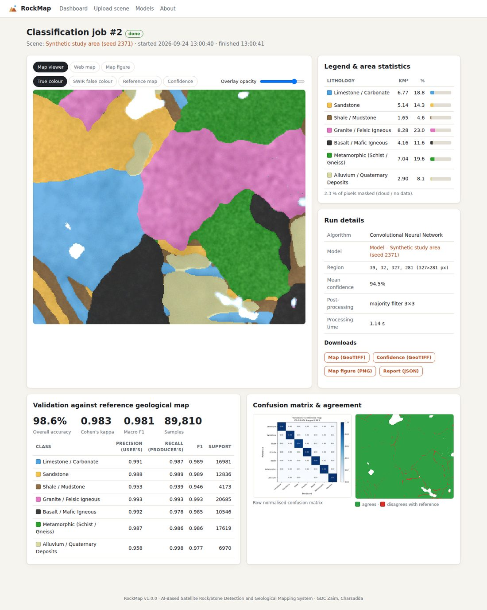

# RockMap: AI-Based Satellite Rock/Stone Detection and Geological Mapping System

This is the Final Year Project of the Department of Computer Science, Government Degree College Zaim, Charsadda (affiliated with Bacha Khan University Charsadda). It was built by **Aleena (Roll No 40)** and **Amna (Roll No 39)** in Semester 7.

RockMap takes free multispectral satellite imagery (Sentinel-2 or Landsat 8/9) and an SRTM elevation model. It classifies the surface into broad **rock and lithology types** with a **Convolutional Neural Network (CNN)**, and compares the CNN against **Random Forest** and **SVM**. It checks the map against a reference geological map and shows the result as an interactive geological map in a **web dashboard**.


*Left to right: true-colour image, SWIR false-colour image, reference geological map, CNN-classified lithology map (synthetic demo study area).*

## Features

| Proposal objective | Where it is implemented |
|---|---|
| Acquire and preprocess Sentinel-2 / Landsat imagery and DEM | `rockmap/preprocessing.py`: converts DN values to reflectance, applies dark-object-subtraction atmospheric correction, and masks clouds (Sentinel-2 SCL, Landsat QA_PIXEL, or the Haze Optimized Transform). It also stacks bands and reprojects the DEM onto the scene grid. |
| Feature extraction: band ratios, indices, terrain | `rockmap/features.py` produces 19 features: 6 bands, 7 spectral indices (NDVI, clay, iron-oxide, ferrous, ferric, brightness, bare-rock) and 6 DEM features (elevation, slope, aspect sin/cos, hillshade, roughness). |
| Training data from existing geological maps | `rockmap/reference.py` turns GeoJSON or shapefile maps into label rasters. `rockmap/sampling.py` draws stratified samples and splits them into spatial blocks for training, validation and testing. |
| CNN deep-learning model, benchmarked against RF / SVM | `rockmap/models/cnn.py` is a fully convolutional PyTorch CNN. `rockmap/models/classical.py` holds the scikit-learn RF and SVM. |
| Classified, colour-coded rock-type map | `rockmap/pipeline.py` and `rockmap/mapping.py` produce the map as GeoTIFF and PNG, plus a confidence map, a majority filter and area statistics in km². |
| Validation against reference maps | `rockmap/evaluation.py` reports overall accuracy, Cohen's kappa, per-class precision, recall and F1, a confusion matrix and an agreement map. |
| Web dashboard: select region, classify, view map | `rockmap/web/`: a Flask app with a SQLite database and background jobs. You can upload scenes, train models, draw a region to classify, and view the map with an opacity slider or on a Leaflet web map. |
| Generalised to any region | Nothing is hard-coded to one location. Any scene with the six canonical bands works, and a reference map is only needed for training and validation. |

## Installation

Python 3.9 or newer is required.

```bash
git clone <this repository> && cd AI-based-stone-rock-detection-model-
python -m venv .venv && source .venv/bin/activate      # Windows: .venv\Scripts\activate
# CPU-only PyTorch (smaller download); skip this line to get the default build
pip install torch --index-url https://download.pytorch.org/whl/cpu
pip install -e ".[dev]"
```

## Quick start (no data download needed)

```bash
rockmap demo          # synthetic study area -> train CNN, RF, SVM -> classify -> validate (~2 min on CPU)
rockmap serve         # open http://127.0.0.1:5000
```

In the dashboard, click **+ Synthetic study area**, then **Start training**. After training, drag a rectangle on the image and click **Classify**.

Demo results (512×512 synthetic scene, 20 m pixels, 19 features, 3,000 samples per class, measured on held-out spatial test blocks):

| Algorithm | Overall accuracy | Kappa | Macro F1 | Full-map agreement with reference | Training time (4-core CPU) |
|---|---|---|---|---|---|
| **CNN** | **98.1 %** | **0.977** | **0.981** | **98.5 %** | 75 s |
| Random Forest | 92.0 % | 0.906 | 0.918 | 96.9 % | 4 s |
| SVM | 93.1 % | 0.919 | 0.930 | 97.5 % | 0.2 s |

These numbers come from a *synthetic* scene, so they show that the pipeline works. They are not a claim about real-world accuracy. Real imagery and generalised published maps will give lower figures, and the project report should quote the numbers from the real study area.

## Working with real data

```bash
# 1. Stack the six bands (B02 B03 B04 B08 B11 B12) of an unzipped Sentinel-2 L2A product at 20 m,
#    appending the SCL cloud layer
rockmap stack --safe S2B_MSIL2A_20260314T054639_....SAFE --resolution 20 --scl --out data/kohat/scene.tif
#    (Landsat 8/9: rockmap stack --bands SR_B2.TIF SR_B3.TIF SR_B4.TIF SR_B5.TIF SR_B6.TIF SR_B7.TIF --qa QA_PIXEL.TIF --out ...)

# 2. Reference geological map: polygons -> label raster on the scene grid
#    mapping.json: {"Kohat Limestone": 1, "Murree Formation": 2, "Alluvium": 7, ...}
rockmap rasterize-map --vector geology.geojson --field UNIT --mapping mapping.json \
                      --scene data/kohat/scene.tif --out data/kohat/reference.tif

# 3. Train and benchmark (the DEM may be in any projection; it is reprojected automatically)
rockmap train --scene data/kohat/scene.tif --dem srtm.tif --labels data/kohat/reference.tif \
              --sensor sentinel2 --out runs/kohat --epochs 30

# 4. Classify the same or a different scene / region, and validate
rockmap classify --model runs/kohat --scene data/kohat/scene.tif --dem srtm.tif \
                 --reference data/kohat/reference.tif --out outputs/kohat_cnn --algorithm cnn
```

Every command also runs as `python -m rockmap <command>`, and `rockmap <command> -h` lists all options. See [docs/USER_MANUAL.md](docs/USER_MANUAL.md) for the full manual, and [docs/ARCHITECTURE.md](docs/ARCHITECTURE.md) for the system design and methodology.

## Lithology classes

| Id | Class | Main spectral / terrain clues |
|---|---|---|
| 1 | Limestone / Carbonate | Bright; CO₃ absorption lowers SWIR2 (high SWIR1/SWIR2) |
| 2 | Sandstone | Iron staining gives a high red/blue ratio |
| 3 | Shale / Mudstone | Clay Al-OH absorption; soft rock, so low relief |
| 4 | Granite / Felsic Igneous | Moderately bright, flat spectrum; resistant, so high relief |
| 5 | Basalt / Mafic Igneous | Very dark (low albedo) |
| 6 | Metamorphic (Schist / Gneiss) | Intermediate albedo, strong texture from foliation |
| 7 | Alluvium / Quaternary Deposits | Valley floors, low slope, partly vegetated |

To change the classes, edit `rockmap/config.py`.

## Dashboard



## Tests

```bash
pytest            # 30 tests: preprocessing, features, sampling, metrics, training, inference, CLI and web app
```

## Project layout

```
rockmap/
  config.py          classes, sensor presets, defaults
  io.py              GeoTIFF read/write, reprojection
  preprocessing.py   reflectance, DOS, cloud masks, band stacking
  features.py        spectral indices, terrain features, normaliser
  synthetic.py       synthetic study-area generator (demo / tests)
  reference.py       vector geological map -> label raster
  sampling.py        stratified sampling, spatial block split, patches
  models/cnn.py      CNN (PyTorch)
  models/classical.py Random Forest, SVM (scikit-learn)
  evaluation.py      accuracy, kappa, F1, confusion matrix
  mapping.py         map rendering, majority filter, statistics, figures
  pipeline.py        train_models(), classify_scene(), ModelBundle
  cli.py             command-line interface
  web/               Flask dashboard (app.py, db.py, templates/, static/)
tests/               pytest suite
docs/                user manual, architecture & methodology, figures
```

## References

See the project proposal. Key sources: Bujak et al. (2021), Sentinel-2 + DEM + Random Forest lithological mapping; Grebby et al. (2011), classifier comparison; Harris et al. (2016), supervised ML for rock types; Zhang et al. (2002), Haze Optimized Transform; USGS EarthExplorer; Copernicus Data Space.
