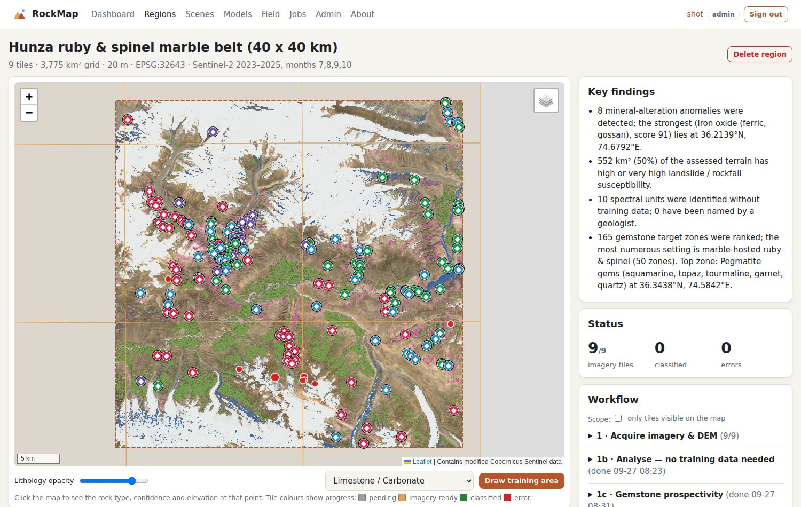
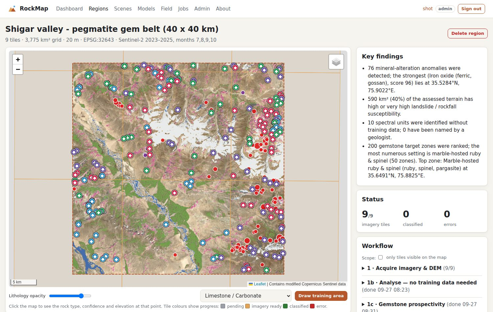

# Gemstone prospectivity

Gilgit-Baltistan is one of the world's great coloured-gemstone provinces. Examples include ruby and spinel in the Hunza marbles, aquamarine, topaz, tourmaline and garnet in the Shigar–Braldu–Basha pegmatites, emerald near Khaltaro, and peridot, nephrite and serpentine in the ultramafic rocks of Kohistan. RockMap has a **gemstone module** that ranks where these deposits are most likely to occur, anywhere in a processed region.

> **What a satellite can and cannot do.** Gem crystals are centimetres across and are never visible from space, at 20 m or any other resolution. What *can* be mapped is the **geological setting** that gems form in: marble bands, swarms of pale pegmatite, contacts between felsic and mafic rocks, and ultramafic bodies. Treat the output as a **ranked shortlist of places to visit**, not as proven deposits.



## 1. Deposit models

| Setting (map colour) | Gems | Evidence used |
|---|---|---|
| **Marble-hosted** (red) | ruby, spinel, pargasite | Carbonate absorption (Sentinel-2 SWIR1/SWIR2), bright iron-poor rock, texture, and proximity to mafic rocks |
| **Pegmatite** (blue) | aquamarine, topaz, tourmaline, garnet, smoky quartz | Bright, spectrally flat, iron-poor rock (leucogranite / pegmatite), high texture from narrow dykes, felsic–mafic contacts |
| **Emerald & beryl contacts** (green) | emerald, beryl | Felsic intrusions within 100–200 m of mafic / ultramafic rock, where Be meets Cr |
| **Ultramafic-hosted** (purple) | peridot, nephrite jade, serpentine | Dark, ferrous (Fe²⁺) rock with an Mg-OH absorption |

How it works:
1. **Mask.** Snow and its surroundings (100 m buffer), cloud, water, fields and orchards (NDVI > 0.3), dark shadow, and flat ground (slope < 15°) are all excluded. Gem host rocks crop out on steep valley walls. Fans, terraces and river beds are bright and would otherwise look like granite.
2. **Evidence.** The band ratios and brightness are converted to robust z-scores, using the median and MAD of **bedrock pixels in the whole region**. Brightness is detrended against solar illumination from the DEM. If a lithology map has been classified, it sharpens the evidence (marble class → carbonate, and so on), and Quaternary deposits are excluded.
3. **Scores.** Each model is a weighted sum of its evidence and gives a score from 0 to 100 per pixel. These scores are the map layers *Gem prospectivity (all)* and one layer per setting.
4. **Target zones.** For each model, compact zones above that model's **top 1 %** threshold (at least 75) are kept. They are ranked by score and size, spaced at least 500 m apart, with at most 50 per setting. Each zone has coordinates, area, peak score and elevation.
5. **Validation and learning.** Upload known gem localities and each model gets an **AUC** (does the model score known localities higher than the rest of the region?) and a *top 10 % / top 20 % capture rate*. With **8 or more localities** inside the region, a **Random Forest** presence/background model is also trained on the same evidence. It is cross-validated by spatial group, and its map appears as the extra layer *Gem prospectivity (data-driven)*.

## 2. Running it

**Dashboard:** open a region → **1c · Gemstone prospectivity → Run**. It needs acquired imagery and takes about 25 s for 9 tiles. The *💎 Gemstone prospectivity* card shows the models, validation, the top target zones with *zoom* links, and CSV / GeoJSON downloads. Diamonds on the map are target zones and yellow stars are known localities. The same information is also in the PDF report and on share links.

**Command line:**
```bash
rockmap region create --preset hunza-gems --out regions/hunza
rockmap region acquire regions/hunza
rockmap region gems regions/hunza --occurrences my_localities.csv
rockmap region mosaic regions/hunza          # map layers gems, gem_marble, gem_pegmatite, ...
```
Presets for gem work are `hunza-gems` (Hunza ruby & spinel marble belt) and `shigar` (Shigar valley pegmatite belt). Any other region works too.

## 3. Known localities (strongly recommended)

Known localities turn the ranking into a model **calibrated on your ground truth**. There are three ways to add them:
* **Upload** a CSV or GeoJSON in the gem card (*Known gem localities*). Columns are `lat,lon,gem,name` (template: `examples/gem_localities_template.csv`). `gem` is one of: ruby, spinel, pargasite, aquamarine, topaz, tourmaline, garnet, quartz, emerald, beryl, peridot, nephrite, serpentine. GeoJSON points need a `gem` property.
* **Field app:** choose the *Gem found* field when recording an observation. Field finds count as known localities automatically.
* **Command line:** `--occurrences FILE`.

Good sources include Geological Survey of Pakistan mineral occurrence records, the Gemstone Corporation of Pakistan, published papers (for example on the Hunza ruby deposits and the Shigar pegmatites), and your own GPS-checked mine and pit locations. **Use surveyed mine or pit coordinates, not village coordinates.** A village sits on the valley floor, but the workings are usually hundreds of metres higher on the slope. RockMap does not ship any locality list, because approximate coordinates would give misleading validation numbers.

## 4. Results on real Sentinel-2 data

We processed three 40 × 40 km areas (9 tiles each) from 2023–2025 late-summer composites:

| Region | High-score area (≥ 75), marble / pegmatite / contact / ultramafic, km² | Target zones |
|---|---|---|
| Gilgit city | 8.3 / 54.2 / 28.9 / 2.4 | 200 |
| Hunza marble belt | 2.3 / 33.6 / 10.9 / 0.4 | 165 |
| Shigar valley | 18.0 / 38.6 / 15.9 / 3.1 | 200 |

In Hunza, the marble model highlights discontinuous bands on the slopes north of the Hunza river. The pegmatite model highlights pale rock on the steep walls of side valleys.



## 5. Limitations (read before selling results)

* **Carbonate is weak at Sentinel-2 resolution.** Band 12 covers only the shoulder of the 2.33 µm carbonate absorption, so the marble signal is subtle. In areas with a lithology map, classify it first, because the marble class strengthens the evidence. ASTER or hyperspectral imagery (EnMAP, PRISMA), which is not bundled, would be much stronger.
* **Pegmatite is over-predicted on pale scree and moraine** that is steep enough to pass the slope mask. Targets next to glaciers need a critical look.
* **Relative, not absolute.** Scores rank ground *within a region*. A 95 in Shigar and a 95 in Gilgit are not directly comparable.
* **Snow hides ground.** Anything under persistent snow or ice is not assessed. High Karakoram pegmatites above about 5,000 m are partly out of reach.
* **No ground truth, no accuracy claim.** Until localities are uploaded, validation shows “–”. Quote AUC and capture rates only when they come from real, independent localities.
