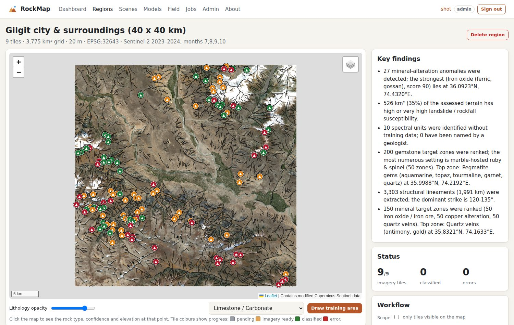

# Structures and mineral prospectivity

RockMap turns free satellite data into the first-pass products of a commercial mineral exploration programme:

- **structural lineaments** (candidate faults and fractures), with a density map and a rose diagram
- **prospectivity maps** for iron, copper and quartz-vein antimony / gold
- **ranked target zones** as CSV and GeoJSON
- **validation** against known occurrences
- a **data-driven model** once enough occurrences are known

## 1. What is produced

| Product | Contents | Formats |
|---|---|---|
| Lineaments | Straight topographic features extracted from the Copernicus DEM, with strike and length | Map layer, `lineaments.geojson`, rose diagram (dashboard and PDF) |
| Lineament density | Lineament length per area (km/km²) in a 2 km window | Used as evidence |
| Iron model | Iron oxide (red/blue) and gossan (SWIR1/red) on fractured ground | Map layer `Minerals - iron oxide / iron ore` |
| Copper model | Clay / sericite (SWIR1/SWIR2) with an iron-oxide cap and high lineament density | Map layer `Minerals - copper alteration` |
| Quartz-vein model | Lineament density and proximity in pale, iron-poor rock, plus the ASTER Quartz Index when imported | Map layer `Minerals - quartz veins (antimony, gold)` |
| Target zones | Top 1 % of the region per model, ranked, at least 500 m apart, at most 50 per model | `mineral_targets.csv`, `.geojson`, PDF page |
| Validation | AUC and top-10 % / top-20 % capture rate of known occurrences | Dashboard, PDF |
| Data-driven model | Random Forest trained on 8 or more known occurrences, cross-validated by spatial group | Map layer `Minerals - data-driven` |

**How to run it:**
- Dashboard: **1d · Lineaments & mineral prospectivity**. It also runs as part of *Run everything*.
- Command line: `rockmap region minerals <region> [--occurrences known.csv] [--aster ast05_*.tif]`.

## 2. What the satellite can and cannot see

| Target | Sentinel-2 + DEM (built in, free) | Needs extra data |
|---|---|---|
| Iron oxide / gossan | ✅ Direct (red/blue, SWIR1/red) | — |
| Clay / sericite alteration (copper) | 🟡 Detects hydroxyl minerals as a group | Kaolinite vs alunite vs sericite: hyperspectral (EnMAP, PRISMA) or ASTER SWIR |
| Structures (faults, veins, dykes) | 🟡 Lineaments of 400 m and longer from a 30 m DEM | Metre-scale veins: very-high-resolution imagery (e.g. WorldView-3) and field mapping |
| Quartz | ❌ No feature in visible or SWIR light | **ASTER thermal bands 10–14**: import them to get the Quartz Index |
| Antimony (stibnite) | ❌ No diagnostic spectral signature at any resolution | Only through its quartz-vein host and structural setting, then field sampling |

Every PDF report states these limits. Target zones are **priorities for field checking, not proven deposits.**

## 3. Adding ASTER thermal data (quartz)

1. Register (free) at https://urs.earthdata.nasa.gov and open https://search.earthdata.nasa.gov.
2. Search for **AST_05** (ASTER L2 Surface Emissivity), draw your area, and choose cloud-free, snow-free scenes, preferably July–October.
3. Convert each HDF file to a GeoTIFF with **bands 10, 11 and 12 in that order**, using QGIS or `gdal_translate`.
4. Upload the files in the dashboard (step 1d → *Upload ASTER & recompute*), or run `rockmap region minerals <region> --aster file1.tif file2.tif`.

RockMap computes the Quartz Index (Rockwell & Hofstra 2008), QI = e11² / (e10 · e12), for every tile. The quartz-vein model then gives it 45 % of its weight.

## 4. Known occurrences (validation and the data-driven model)

- **Upload:** in the dashboard, use *Mineral prospectivity & structures → Known mineral occurrences*. Upload a CSV with columns `lat, lon, commodity, name` (template: `examples/mineral_occurrences_template.csv`) or GeoJSON points with a `commodity` property.
- **Recognised commodities:** iron, haematite, magnetite, copper, porphyry, molybdenum, antimony, stibnite, gold, quartz. Other commodities are stored but not validated.
- **Field app:** choose *Mineral occurrence here*. These observations are added automatically.
- **Good sources:** Geological Survey of Pakistan mineral maps (e.g. the *Mineral Map of Gilgit-Baltistan*), published papers, and company records. Use surveyed mine or pit coordinates.

With 8 or more occurrences inside the region, a Random Forest is trained on the six evidence layers and scored with spatially grouped cross-validation (AUC). This matches the "Phase 2 — supervised ML refinement" that exploration consultancies sell separately.

## 5. Method details (for reports)

**Lineaments:**
1. Compute hillshades of the DEM lit from 0°, 45°, 90° and 135° at 30° elevation.
2. Detect edges with a Sobel filter, keeping the top 15 % of each hillshade.
3. Keep a pixel as a lineament when at least 70 % of a 600 m line through it, in one of 12 directions, is also edge.
4. Vectorise connected runs of equal strike into straight segments of at least 400 m.

In high mountains, many lineaments are ridges and valleys rather than faults. They are candidates for a geologist to interpret.

**Evidence:**
1. Convert each band ratio to a robust z-score (median and MAD) over usable bedrock in the whole region. Usable means slope ≥ 15°, and no snow, vegetation, water or data gaps.
2. Map each z-score to a fuzzy membership from 0 to 1 (3 σ = 1).
3. Score each model as the weighted sum of its memberships (0.7 = 100). The vein model is also multiplied by host-rock evidence, because structures alone are everywhere in the Karakoram.

**Targets:** connected zones above each model's own 99th percentile (at least 75), with a minimum of 12 pixels, ranked by mean score × log(size).
